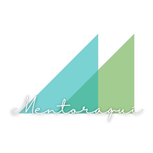

# Mentoraqui-Front

### Descrição:

Mentoraqui é uma plataforma com a  missão de conexão com propósito. Ela conecta  jovens talentos com mentores voluntários que possuem experiência em diferentes mercados de trabalho, vivências e histórias, com o objetivo de criarmos caminhos diferentes para transformação. O match acontecerá através de um formulário preenchido por ambos, mentor e mentorado. Após as mentorias indicamos instituições de ensino conveniadas, para que os jovens possam se qualificar na área desejada, e/ou buscar emprego nas áreas que mais demandam mão de obra. A plataforma tem como público-alvo jovens que estão em busca do primeiro emprego, desenvolvimento de carreira e/ou iniciar o ensino superior / técnico.

### Autores:
Membros da equipe: 
- [Ana Paula Schran de Almeida - Skill UX](https://www.linkedin.com/in/anaschran/)
- [Diego de Castro Rodrigues - Skill Engenharia/Desenvolvimento](https://www.linkedin.com/in/diegocastro-r/)
- [Gabriel Ernesto Barboza Pereira - Skill Engenharia/Desenvolvimento](https://www.linkedin.com/in/gabriel-ernesto-barboza-pereira-6933621a2/) 
- [Lethicia de Moura Silva - Skill Marketing](https://www.linkedin.com/in/lethicia-moura-307183ba/)
- [Scarlet Cristina de Araújo - Skill Business](https://www.linkedin.com/in/scarlet-ara%C3%BAjo-61160852/)
- [Simone Perez Miquelin - Skill Especialista em RH/Educação](https://www.linkedin.com/in/simone-miquelin/)

### Tecnologia: 

O site foi construindo usando a linguagem PHP unida ao HTML
Foi utilizado o framework Bootstrap unido ao CSS para estilizar as páginas

As páginas estão apenas guiando umas para as outras, sem ocorrer validação em momento algum, pois o foco deste repositório foi mostrar como a equipe imaginou as páginas

### Como rodar o projeto:

Para rodar o projeto deste repositório basta rodar em servidor local
